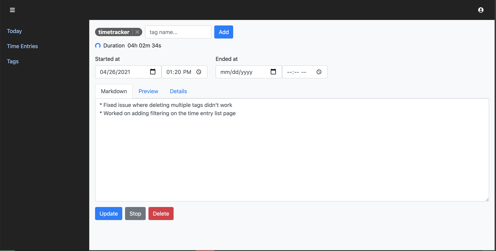

# TimeTracker

Web App for tracking your time. Currently only locally deployable.




## Features

* Use tags on each time entry so you can track multiple records at once
* Add descriptions in Markdown for Time Entries 
* Keep track of Tasks and their associated time entries
* Keep track of how often events happen with Timestamps
* Working on more, see [TimeTracker Project](https://github.com/Vafilor/TimeTracker/projects/1)

## Local Setup

1. Make sure you have php 8.0 or greater
2. Install [Composer](https://getcomposer.org/download/)
3. Install [Yarn](https://classic.yarnpkg.com/en/docs/install)
4. Install [Symfony Binary](https://symfony.com/download)
   
5. Cd to project root and run

```bash
composer install
yarn install
yarn encore dev
php bin/console lexik:jwt:generate-keypair
```

6. Set up your database connection in `.env`. postgresql, mysql, mariadb, sqlite are supported.
    
7. Setup database

```bash
symfony console doctrine:database:create 
```

8. Run migrations

```bash
./bin/console doctrine:migrations:migrate
```

9. Create your user

```bash
./bin/console app:user:create
```

10. Start the symfony server

```bash
symfony serve
```

## Local Setup with Docker (wip)

1. Make sure you have php 8.0 or greater
2. Install [Composer](https://getcomposer.org/download/)
3. Install [Yarn](https://classic.yarnpkg.com/en/docs/install)
4. Install [Symfony Binary](https://symfony.com/download)
5. Install [Docker](https://www.docker.com/get-started)

6. Cd to project root and run

```bash
composer install
yarn install
yarn encore dev
php bin/console lexik:jwt:generate-keypair
```

7. Setup database with docker

```bash
docker-compose up -d 
```

8. Run migrations

```bash
./bin/console doctrine:migrations:migrate
```

9. Create your user

```bash
./bin/console app:user:create
```

10. Start the symfony server

```bash
symfony serve
```

## App Concepts

### Continue

This will create a new time entry with the same tags. 

### Resume

This will remove the 'ended' part of the current time entry and resume the timer.
This is mostly for "oops" moments when you accidentally stopped a time entry.

## Rest API

To get the Auth Token

POST to /api/login_check
With headers
 * Content-Type: application/json (required)
Body
```json
{
    "username": "email@email.com",
    "password": "password"
}
```

Note: body says `username` but it is actually the `email`

You get

```json
{
  "token": "token..."
}
```

in response.

Then, provide the token as a header: 
Authorization: Bearer <token>

As an example, you can get the time entries with

GET /api/time-entry
With headers
* Content-Type: application/json (required)

### DateTime

When a field is a DateTime, use the following format in requests

```json
"endedAt": {
    "date": "yyyy-mm-dd",
    "time": "hh:mm:ss"
}```

Where hh is 24 hour time.

For example,

```json
"endedAt": {
    "date": "2021-04-16",
    "time": "13:33:01"
}```

Will result in: `04/16/2021 01:33:01 PM`